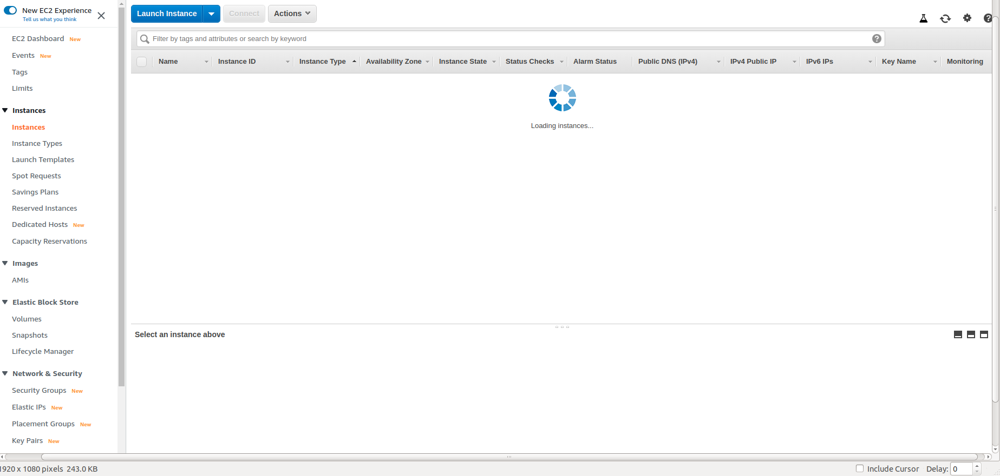

 

 Deplyment  is moving your code from local machine to the server to make your application accessible by end-users. in this article we will go through all the process from setting the instance, dependencies, to deploying the code using the Capistrano tool

-  Set up EC2 Ubuntu 

`Note: if you already configured the instance, please jump to the next step`

First of all, we will need a valid AWS account to setup the instance. if you already have an account, please [Sign in](https://signin.aws.amazon.com/signin?redirect_uri=https%3A%2F%2Fconsole.aws.amazon.com%2Fconsole%2Fhome%3Fstate%3DhashArgs%2523%26isauthcode%3Dtrue&client_id=arn%3Aaws%3Aiam%3A%3A015428540659%3Auser%2Fhomepage&forceMobileApp=0&code_challenge=MD3yXqK8aNOciUyEyk4HgGKVt2IxqIoyUV4kG98YHnU&code_challenge_method=SHA-256) otherwise, create a new one [Create an AWS account](https://portal.aws.amazon.com/billing/signup#/start)

Assuming you have created an AWS account let's login to our console and set up the instance
- Step 1: Select the first one `EC2`

- Step 2: go to instances and select launch instance

- Step 3: Choose an Amazon Machine Image (AMI) in our case we will choose `Ubuntu Server 18.04 LTS (HVM), SSD Volume Type` and complete the rest of the steps and coonect to the server using peom file.

