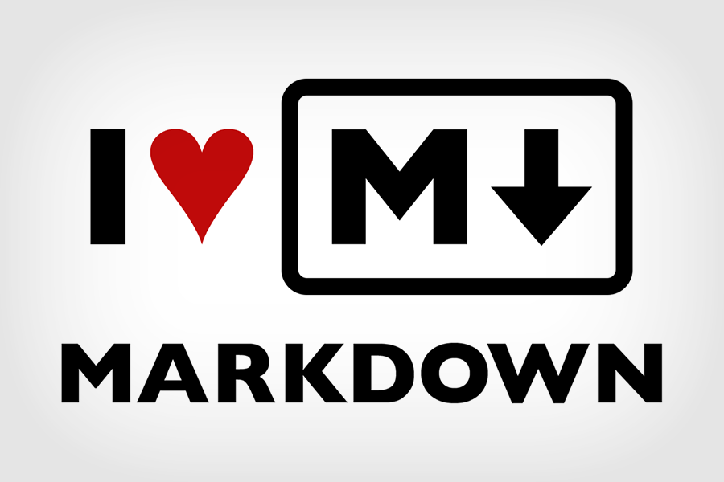

## Overview

Markdown is intended to be as easy-to-read and easy-to-write as is feasible. Markdown's syntax is intended for one purpose: to be used as a format for writing for the web.

Markdown is not a replacement for HTML, or even close to it. Its syntax is very small, corresponding only to a very small subset of HTML tags. The idea is not to create a syntax that makes it easier to insert HTML tags. In my opinion, HTML tags are already easy to insert. The idea for Markdown is to make it easy to read, write, and edit prose. HTML is a publishing format; Markdown is a writing format.

For any markup that is not covered by Markdown's syntax, you simply use HTML itself. There's no need to preface it or delimit it to indicate that you're switching from Markdown to HTML; you just use the tags.

For example, to add an HTML table to a Markdown article:

```html
This is a regular paragraph.

<table>
    <tr>
        <td>Foo</td>
    </tr>
</table>

This is another regular paragraph.
```

## Headers

Markdown supports two styles of headers, Setext and atx.

Setext-style headers are "underlined" using equal signs (for first-level headers) and dashes (for second-level headers). For example:

```markdown
This is an H1
=============

This is an H2
-------------
```
Any number of underlining ='s or -'s will work.

Atx-style headers use 1-6 hash characters at the start of the line, corresponding to header levels 1-6. For example:

```markdown
# This is an H1

## This is an H2

###### This is an H6
```

Optionally, you may "close" atx-style headers. This is purely cosmetic -- you can use this if you think it looks better. The closing hashes don't even need to match the number of hashes used to open the header. (The number of opening hashes determines the header level.) :

```markdown
# This is an H1 #

## This is an H2 ##

### This is an H3 ######
```

## Blockquotes

Markdown uses email-style > characters for blockquoting. If you're familiar with quoting passages of text in an email message, then you know how to create a blockquote in Markdown. It looks best if you hard wrap the text and put a > before every line:

```markdown
> This is a blockquote with two paragraphs. Lorem ipsum dolor sit amet,
> consectetuer adipiscing elit. Aliquam hendrerit mi posuere lectus.
> Vestibulum enim wisi, viverra nec, fringilla in, laoreet vitae, risus.
>
> Donec sit amet nisl. Aliquam semper ipsum sit amet velit. Suspendisse
> id sem consectetuer libero luctus adipiscing.
```

it should looks like

> This is a blockquote with two paragraphs. Lorem ipsum dolor sit amet,
> consectetuer adipiscing elit. Aliquam hendrerit mi posuere lectus.
> Vestibulum enim wisi, viverra nec, fringilla in, laoreet vitae, risus.
>
> Donec sit amet nisl. Aliquam semper ipsum sit amet velit. Suspendisse
> id sem consectetuer libero luctus adipiscing.

Also markdown allows you to be lazy and only put the > before the first line of a hard-wrapped paragraph:

```markdown
> This is a blockquote with two paragraphs. Lorem ipsum dolor sit amet,
consectetuer adipiscing elit. Aliquam hendrerit mi posuere lectus.
Vestibulum enim wisi, viverra nec, fringilla in, laoreet vitae, risus.

> Donec sit amet nisl. Aliquam semper ipsum sit amet velit. Suspendisse
id sem consectetuer libero luctus adipiscing.
```

## Lists

Markdown supports ordered (numbered) and unordered (bulleted) lists.

Unordered lists use asterisks, pluses, and hyphens -- interchangably -- as list markers:

```markdown
*   Red
*   Green
*   Blue
```

is equivalent to:

```markdown
+   Red
+   Green
+   Blue
```

and

```markdown
-   Red
-   Green
-   Blue
```

Ordered lists use numbers followed by periods:

```markdown
1.  Bird
2.  McHale
3.  Parish
```

## Code Blocks

Pre-formatted code blocks are used for writing about programming or markup source code. Rather than forming normal paragraphs, the lines of a code block are interpreted literally. Markdown wraps a code block in both

To produce a code block in Markdown, simply indent every line of the block by at least 4 spaces or 1 tab. For example, given this input:

```markdown
This is a normal paragraph:

    This is a code block.
```

Markdown will generate:

```markdown
<p>This is a normal paragraph:</p>

<pre><code>This is a code block.
</code></pre>
```


## Horizontal Rules

You can produce a horizontal rule tag
```markdown
(<hr />)
```
by placing three or more hyphens, asterisks, or underscores on a line by themselves. If you wish, you may use spaces between the hyphens or asterisks. Each of the following lines will produce a horizontal rule:

```markdown
* * *

***

*****

- - -

---------------------------------------
```

## Span Elements

### Links
Markdown supports two style of links: inline and reference.

In both styles, the link text is delimited by [square brackets].

To create an inline link, use a set of regular parentheses immediately after the link text's closing square bracket. Inside the parentheses, put the URL where you want the link to point, along with an optional title for the link, surrounded in quotes. For example:

```markdown
This is [an example](http://example.com/ "Title") inline link.

[This link](http://example.net/) has no title attribute.
```

Will produce:

```html
<p>This is <a href="http://example.com/" title="Title">
an example</a> inline link.</p>

<p><a href="http://example.net/">This link</a> has no
title attribute.</p>
```

and will output:

<p>This is <a href="http://example.com/" title="Title">
an example</a> inline link.</p>

<p><a href="http://example.net/">This link</a> has no
title attribute.</p>


If you're referring to a local resource on the same server, you can use relative paths:

```markdown
See my [About](/about/) page for details.
```

Reference-style links use a second set of square brackets, inside which you place a label of your choosing to identify the link:

```markdown
This is [an example][id] reference-style link.
```

You can optionally use a space to separate the sets of brackets:

```markdown
This is [an example] [id] reference-style link.
```

Then, anywhere in the document, you define your link label like this, on a line by itself:

```markdown
[id]: http://example.com/  "Optional Title Here"
```


Emphasis

Markdown treats asterisks (*) and underscores (_) as indicators of emphasis.

```markdown
*single asterisks*

_single underscores_

**double asterisks**

__double underscores__
```

will produce:

```html
<em>single asterisks</em>

<em>single underscores</em>

<strong>double asterisks</strong>

<strong>double underscores</strong>
```

## Images

Admittedly, it's fairly difficult to devise a "natural" syntax for placing images into a plain text document format.

Markdown uses an image syntax that is intended to resemble the syntax for links, allowing for two styles: inline and reference.

Inline image syntax looks like this:

```markdown


```
## Videos

Markdown provides two ways for video links to be embedded in markdown files.

The first way is to trick the user into thinking the video is on the markdown file with a picture. It sounds like an ad trick, it's not perfect, but it works and it's funny!
```markdown
[](https://www.youtube.com/watch?v=HJZ9TnKrt7Q "Alpha preview: Action Text for Rails 6")
```
Like:

[](https://www.youtube.com/watch?v=HJZ9TnKrt7Q "Alpha preview: Action Text for Rails 6")

and the second one is to display videos from YouTube
This method works for YouTube videos and any other embed video within an `<iframe>` tag.

```markdown
<!-- blank line -->
<figure class="video_container">
  <iframe src="https://www.youtube.com/embed/enMumwvLAug" frameborder="0" allowfullscreen="true"> </iframe>
</figure>
<!-- blank line -->
```

## Miscellaneous

Markdown supports a shortcut style for creating "automatic" links for URLs and email addresses: simply surround the URL or email address with angle brackets. What this means is that if you want to show the actual text of a URL or email address, and also have it be a clickable link, you can do this:

```markdown
<http://example.com/>
```

Markdown will turn this into:

```html
<a href="http://example.com/">http://example.com/</a>
```

### Backslash Escapes

Markdown allows you to use backslash escapes to generate literal characters which would otherwise have special meaning in Markdown's formatting syntax. For example, if you wanted to surround a word with literal asterisks (instead of an HTML <em> tag), you can use backslashes before the asterisks, like this:

```markdown
\*literal asterisks\*
```

Markdown provides backslash escapes for the following characters:

```markdown
\   backslash
`   backtick
*   asterisk
_   underscore
{}  curly braces
[]  square brackets
()  parentheses
#   hash mark
+   plus sign
-   minus sign (hyphen)
.   dot
!   exclamation mark
```

The last thing I would like to share with you is the great extension [Markdown preview](https://code.visualstudio.com/docs/languages/markdown#_markdown-preview) that has been added in vscode extensions to preview that markdown files while you're writing in it.


## References
- [markdown guide basic syntax](https://www.markdownguide.org/basic-syntax/)
- [How to Change the Styling of a Word in a Line of Text on Squarespace](https://www.megangodardcardon.com/blog/change-style-one-word-squarespace)